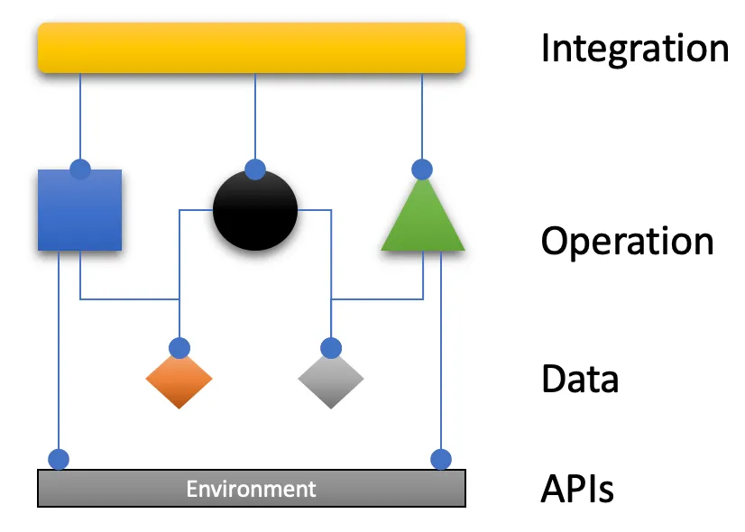

inspired by https://ralfwestphal.substack.com/p/ioda-architecture

#### Prerequisites:
Java 21

### IODA

There is a fundamental difference to the HA and all other architectural patterns: no functional dependencies exist between the concerns! No usage is implied, no relationships are drawn between the concerns. They exist in no hierarchy. They are all on eye level.

#### References:
* https://ralfwestphal.substack.com/p/ioda-architecture
* https://ccd-akademie.de/en/dip-oder-iosp/